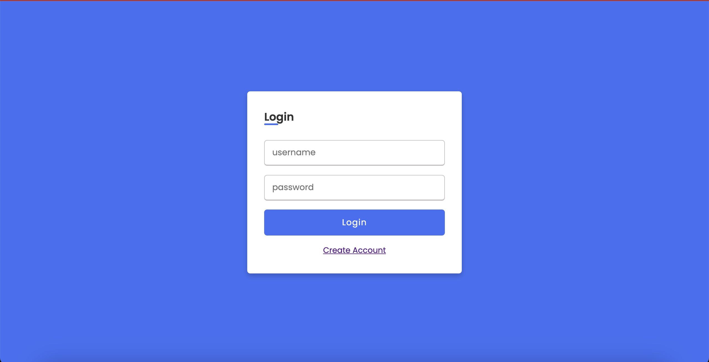
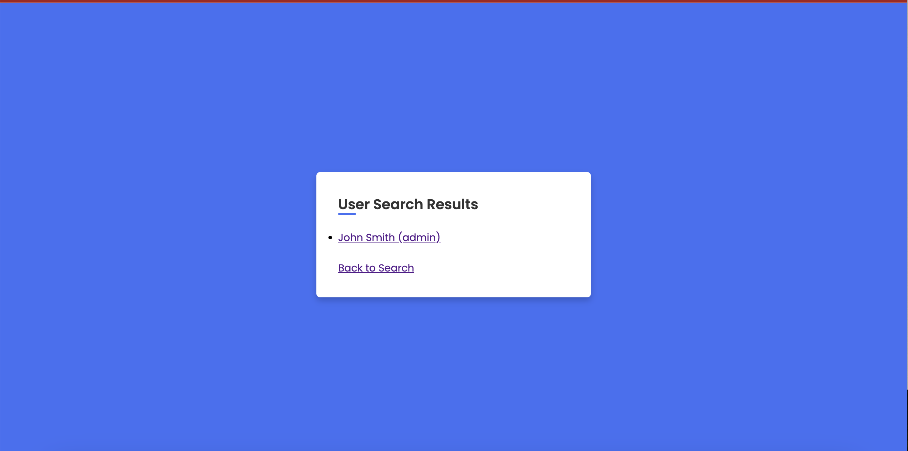
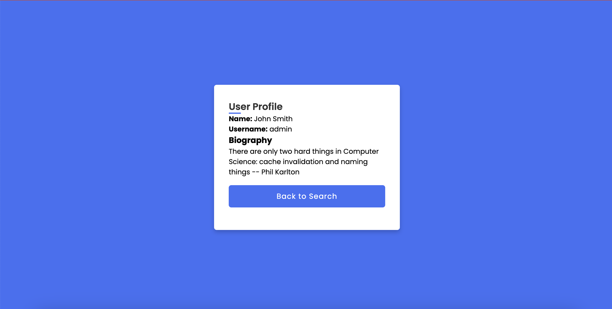

# SQL Injection Practice

A series of methods for SQL Injection and explanations of methods.

## How to reproduce work

Unfortunately it is proprietary to BU CS357, but I have attached screenshots of the pages available

## Pages

#### Login `localhost:8080/`

#### Register `localhost:8080/register`

#### Search `localhost:8080/search`

#### Search Result `localhost:8080/search`

#### Profile `localhost:8080/profile?username=admin`

